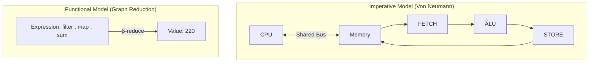

import { quizData } from '@/content/quiz-data/sem3/csi243/01-paradigm-shift-quiz';

# Chapter 1: The Paradigm Shift & FP Principles

## Learning Objectives
1. Distinguish between the 4 major programming paradigms (Imperative, Object-Oriented, Logic, Functional).
2. Define core FP principles: Modularity, Maintainability, Immutability, Side Effects, First-Class/Higher-Order Functions, and Function Composition.
3. Differentiate between pure and impure functions using standard imperative vs. functional examples.
4. Annotate imperative code with Von Neumann hardware operations and contrast with the declarative evaluation model.
5. Encode logic using Church Booleans and trace step-by-step β-reduction of a non-trivial lambda expression.
6. Prove Referential Transparency formally and explain compiler optimisation consequences.

---

## 1.1 The 4 Programming Paradigms

Programming paradigms are fundamental styles of computer programming. Understanding them is crucial for multiple-choice questions on language classification.

1. **Imperative**: Focuses on *how* to achieve a goal by describing a sequence of commands that change the program's state. Key concepts: state changes, loops, and explicit control flow (e.g., C, Java, Python).
2. **Object-Oriented (OOP)**: Organises software design around data, or objects, rather than functions and logic. Key concepts: 
   - *Abstraction*: Hiding complex reality while exposing only necessary parts.
   - *Encapsulation*: Bundling data and methods that operate on that data, restricting direct access.
   - *Inheritance*: Mechanism where a new class derives properties and characteristics from an existing class.
   - *Polymorphism*: Ability of different objects to respond to the same method call in their own way.
3. **Logic**: Based on formal logic. Programs are expressed as a set of facts and rules. Computation is a process of logical deduction (e.g., Prolog).
4. **Functional**: Treats computation as the evaluation of mathematical functions and avoids changing state and mutable data. It is a *declarative* paradigm (focuses on *what* to compute, not *how*).

---

## 1.2 FP Core Principles

Functional Programming relies on several foundational principles that distinguish it from imperative paradigms:

- **Modularity**: Breaking down a program into smaller, independent, and interchangeable components (functions) that can be developed, tested, and reasoned about in isolation.
- **Maintainability**: The ease with which a software system can be modified to correct faults, improve performance, or adapt to a changed environment. FP enhances this through predictable, side-effect-free code.
- **Immutability**: Once a data structure is created, it cannot be changed. Instead of modifying existing data, operations produce new data structures. This eliminates entire classes of bugs related to shared mutable state.
- **Side Effects**: Any observable interaction with the outside world (e.g., modifying a global variable, writing to a file, printing to the console, or making a network request). FP strives to isolate and minimise side effects.
- **First-Class and Higher-Order Functions**: 
  - *First-Class*: Functions are treated as "first-class citizens", meaning they can be assigned to variables, passed as arguments, and returned from other functions.
  - *Higher-Order*: Functions that take other functions as arguments or return functions as results (e.g., `map`, `filter`, `reduce`).
- **Function Composition**: The mathematical concept of combining two or more functions to produce a new function, where the output of one function becomes the input of the next (e.g., `f(g(x))` or `f . g` in Haskell).

---

## 1.3 Pure vs. Impure Functions

A function is **pure** if, for the same inputs, it always produces the same output and performs no observable side effects. Otherwise, it is **impure**.

### Example 1: `squaredSum` (Imperative vs. Functional)

**Imperative (Impure-leaning style due to mutation):**
```c
int squaredSum(int* arr, int n) {
    int sum = 0;                       // Mutable state
    for (int i = 0; i < n; i++) {      // Explicit loop control
        sum += arr[i] * arr[i];        // State mutation
    }
    return sum;
}
```

**Functional (Pure):**
```haskell
squaredSum :: [Int] -> Int
squaredSum = sum . map (\x -> x * x)

-- GHCi session
ghci> squaredSum [1, 2, 3]
14
```
*No mutable state, no explicit loops. The function is purely a composition of transformations.*

### Example 2: The `notPure` Global Variable

```c
int global_counter = 0;

int next_id() {
    return ++global_counter;  // Reads and mutates hidden external state
}

/* 
   This breaks Referential Transparency:
   next_id() + next_id()  evaluates to 1 + 2 = 3
   If we replaced next_id() with its "value" 1:
   1 + 1 = 2   — a different result! 
*/
```
In Haskell, the type system prevents this. A function `Int -> Int` has *no mechanism* to touch global state, guaranteeing purity.

---

## 1.4 The Von Neumann Bottleneck

Imperative programming (C, Java, Python) is a direct reflection of the Von Neumann architecture. In that model, the CPU and memory are separated by a shared bus, and computation is the act of repeatedly shuttling data across that bus: fetch a value, compute something, write it back. Imperative programs *mirror* this hardware ceremony at the source level, which is precisely what John Backus called the "Von Neumann bottleneck" in his 1977 Turing Award lecture.

Consider computing the sum of squares of even numbers in C:

```c
int sum_sq_even(int* arr, int n) {
    int sum = 0;                       /* STORE: initialise accumulator */
    for (int i = 0; i < n; i++) {      /* FETCH i, ALU compare, ALU increment */
        if (arr[i] % 2 == 0) {         /* FETCH arr[i], ALU modulo */
            sum += arr[i] * arr[i];    /* FETCH arr[i], ALU multiply, STORE */
        }
    }
    return sum;
}
```

Every line is occupied with *how* data moves: which register holds what, when the write happens, where the loop counter lives. The algorithm is buried in memory-management noise.

Now the exact same computation in Haskell:

```haskell
sumSqEven :: [Int] -> Int
sumSqEven = sum . map (\x -> x * x) . filter even

-- GHCi session
ghci> sumSqEven [1, 2, 3, 4, 5]
20
ghci> sumSqEven [1..10]
220
```

There is no FETCH, no STORE, no loop counter. We compose three mathematical transformations and state *what* the result is. The compiler decides how to allocate registers, fuse the traversals, and exploit the CPU cache.


*Figure 1.1: The Von Neumann fetch-execute cycle vs graph reduction. Functional programs describe transformations; the runtime engine decides the hardware mechanics.*

The arrow of dependency in Haskell flows from expression to value, not from memory address to memory address. This is the paradigm shift.

---

## 1.5 Advanced Theory: Lambda Calculus & β-Reduction

Functional programming is rooted in Alonzo Church's λ-calculus, a formal system for expressing computation using nothing but function abstraction and application. It is not a programming trick; it is a proof that computation itself can be captured without any notion of mutation, state, or hardware.

### Church Encoding: Booleans From Nothing

How do you encode `TRUE` and `FALSE` if you have no primitive booleans — only functions? By behaviour. A boolean is a *choice*: given two alternatives, it picks one.

```haskell
-- TRUE picks the first alternative
true :: a -> a -> a
true x y = x

-- FALSE picks the second alternative
false :: a -> a -> a
false x y = y

-- AND: if p, evaluate q; otherwise, the answer is already false (p)
and' :: (a -> a -> a) -> (a -> a -> a) -> (a -> a -> a)
and' p q = p q p

-- GHCi session
ghci> true 'Y' 'N'
'Y'
ghci> false 'Y' 'N'
'N'
ghci> and' true false 'Y' 'N'
'N'
ghci> and' true true 'Y' 'N'
'Y'
```

This is not a curiosity — it is the proof that lambda calculus is Turing-complete without any primitives whatsoever. Numbers, booleans, data structures, even recursion (via the Y combinator) all emerge from function abstraction alone.

> ⚠️ **Common Misconception:** "Lambda calculus is just Haskell's syntax for anonymous functions."
> **Correction:** Lambda calculus is the universal model of computation on which Haskell is *built*. Every Haskell expression is ultimately a lambda term. The GHC runtime is an optimised β-reduction machine. Anonymous functions are merely the surface syntax.

### β-Reduction: A Full Step-by-Step Trace

β-reduction is the mechanical substitution rule: applying a function to an argument replaces the parameter with the argument in the function body. We must show *every intermediate term*, not just the start and end.

**Expression:** `(λf. λx. f (f x)) (λy. y + 1) 0`

Read this as: "Apply the function 'apply f twice' to the successor function, then to 0."

```
Step 1 — Apply outermost λf to (λy. y + 1):
  Substitute f := (λy. y + 1) throughout the body λx. f (f x)
  Result: λx. (λy. y + 1) ((λy. y + 1) x)

Step 2 — Apply λx to 0:
  Substitute x := 0 throughout the body (λy. y + 1) ((λy. y + 1) x)
  Result: (λy. y + 1) ((λy. y + 1) 0)

Step 3 — Reduce the inner application (λy. y + 1) 0:
  Substitute y := 0 in body (y + 1)
  Result: (λy. y + 1) (0 + 1)

Step 4 — Reduce arithmetic 0 + 1:
  Result: (λy. y + 1) 1

Step 5 — Reduce the outer application (λy. y + 1) 1:
  Substitute y := 1 in body (y + 1)
  Result: 1 + 1

Step 6 — Reduce arithmetic 1 + 1:
  Result: 2
```

The Haskell equivalent, to confirm intuition:

```haskell
applyTwice :: (a -> a) -> a -> a
applyTwice f x = f (f x)

successor :: Int -> Int
successor y = y + 1

-- GHCi session
ghci> applyTwice successor 0
2
ghci> applyTwice (+3) 10
16
```

Every step above corresponds to a GHC Core reduction. Understanding this trace is what separates students who can *use* Haskell from students who understand *why* it behaves the way it does.

---

## 1.6 Referential Transparency & Compiler Optimisations

A function is **pure** if, for the same inputs, it always produces the same output and performs no observable side effects. This guarantees **Referential Transparency (RT)**: any expression can be replaced by its value without changing the program's behaviour.

### The Compiler Optimisation Payoff

Purity is not merely a philosophical ideal — it is what makes advanced compilation strategies *safe*:

**Common Subexpression Elimination (CSE):** If `f x` appears twice in an expression and `f` is pure, GHC can evaluate it once and share the result. In C, a call to `f(x)` might have side effects, so the compiler cannot safely eliminate the second call.

```haskell
-- GHC can rewrite this:
expensive x + expensive x
-- Into this (safe because expensive is pure):
let v = expensive x in v + v
```

**Inlining:** GHC aggressively inlines small pure functions because it knows inlining cannot change observable behaviour. This is the foundation of Haskell's "abstraction without overhead" guarantee.

**Memoisation:** Lazy evaluation combined with purity means any thunk can be computed at most once and the result shared. The runtime *automatically* memoises pure computations via graph sharing.

> ⚠️ **Common Misconception:** "Pure functions can't do anything useful — you can't even print to the screen."
> **Correction:** Pure functions *describe* I/O as data structures — recipes that the Haskell Runtime System (RTS) interprets and executes. A value of type `IO ()` is a pure description of an effect, not the effect itself. The boundary between description and execution is the `main` function, which the RTS runs. Purity is preserved; usefulness is not sacrificed.

```haskell
-- These are pure VALUES — descriptions of effects
greet :: String -> IO ()
greet name = putStrLn ("Hello, " ++ name)

-- The RTS executes them, not the Haskell evaluator
main :: IO ()
main = greet "Alice" >> greet "Bob"
```

<Quiz title="Chapter 1 Knowledge Check" questions={quizData} />