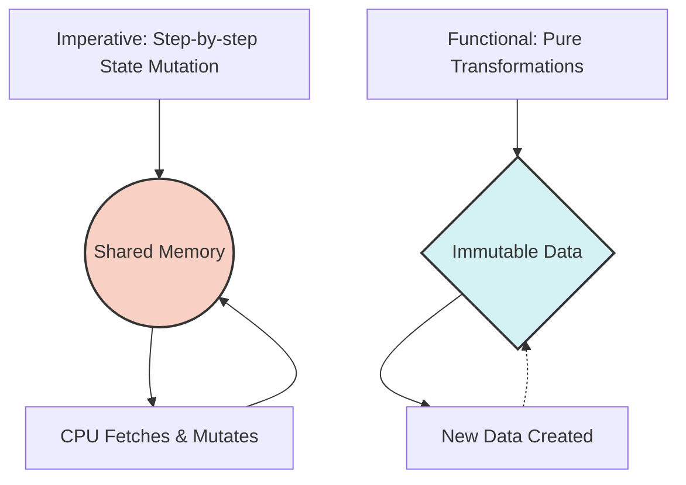

import { Quiz } from '@/components/quiz';
import { quizData } from '@/content/quiz-data/sem3/csi243/01-paradigm-shift-quiz';

# The Paradigm Shift

Welcome to **CSI243: Functional Programming**. In this chapter, we explore the fundamental shift in how we think about computation, moving from the traditional imperative model to the elegant, mathematically grounded world of functional programming.

## Imperative vs. Functional Programming

To understand functional programming, we must first contrast it with the paradigm most of us start with: **Imperative Programming** (e.g., C, Java, Python). 

| Feature | Imperative (C/Java) | Functional (Haskell) |
|---|---|---|
| **State** | Mutable (Variables change over time) | Immutable (Data is transformed, never mutated) |
| **Control Flow** | Loops (`for`, `while`) and `goto` | Recursion & Higher-Order Functions (HOFs) |
| **Execution Model** | Step-by-step instructions (*How* to do it) | Declarative expressions (*What* to compute) |
| **Side Effects** | Common (I/O, global state mutation) | Isolated and strictly controlled |

> **Analogy**: Think of imperative programming like giving a robot turn-by-turn driving directions ("turn left, accelerate, brake"). Functional programming is like giving the robot a destination and a map, trusting it to figure out the optimal route based on immutable rules.

### The Von Neumann Bottleneck
Imperative languages are heavily influenced by the **Von Neumann architecture**, where the CPU and memory are separate. The CPU must constantly fetch instructions and data across a shared bus, mutate the data in memory, and write it back. This creates a "bottleneck" because the CPU is much faster than the memory bus. Functional programming mitigates this by focusing on *expressions* and *transformations* rather than sequential memory mutation, enabling better compiler optimizations and parallel execution.

## Lambda Calculus ($\lambda$-calculus)

Functional programming is not just a coding style; it is rooted in **Lambda Calculus**, a formal system in mathematical logic for expressing computation based on function abstraction and application. Developed by Alonzo Church in the 1930s, it proves that any computable function can be expressed and evaluated using this formalism.

The core components are:
1. **Variables**: $x, y, z$
2. **Abstraction**: $\lambda x. M$ (Defining an anonymous function that takes $x$ and returns $M$)
3. **Application**: $(\lambda x. M) N$ (Applying the function to an argument $N$)
4. **$\beta$-reduction**: The process of evaluating an application by substituting the argument $N$ for every free occurrence of $x$ in $M$.

**Example of $\beta$-reduction:**
$$(\lambda x. x + 2) \ 3 \rightarrow_\beta 3 + 2 \rightarrow 5$$

## Pure Functions & Referential Transparency

A function is considered **pure** if it satisfies two conditions:
1. **Deterministic**: Given the same input, it always produces the exact same output.
2. **No Side Effects**: It does not mutate global state, perform I/O operations, or throw unpredictable exceptions.

This purity guarantees **Referential Transparency**. An expression is referentially transparent if it can be replaced by its evaluated value (or vice versa) without changing the program's behavior. 

### Why does this matter?
- **Equational Reasoning**: You can prove program correctness using mathematical substitution, just like in algebra.
- **Compiler Optimization**: The compiler can safely cache results (memoization), eliminate dead code, or reorder evaluations without fear of altering program state.
- **Concurrency**: Without shared mutable state, race conditions and deadlocks are inherently impossible, making parallel execution trivial.

<Quiz title="Chapter 1 Knowledge Check" questions={quizData} />