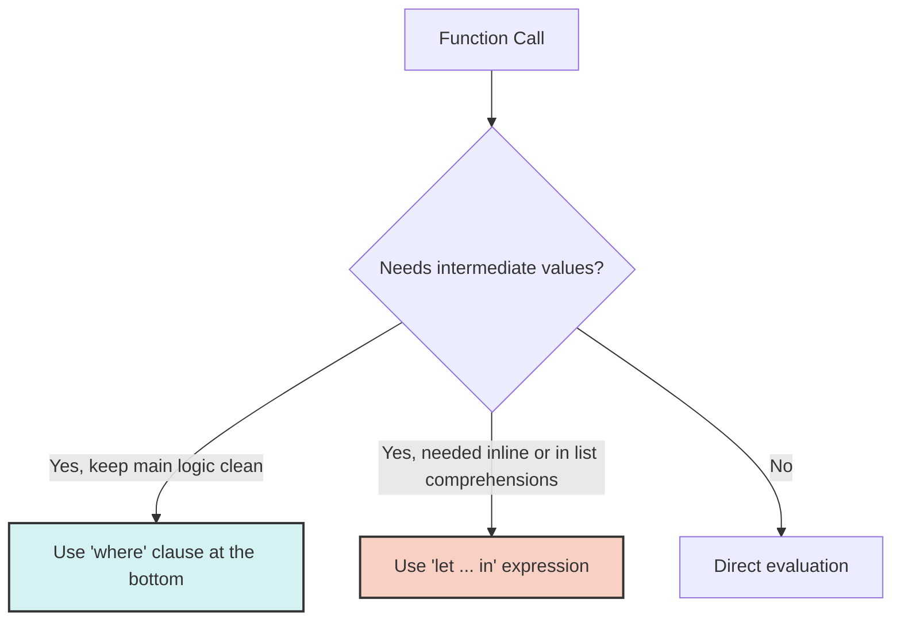

import { Quiz } from '@/components/quiz';
import { quizData } from '@/content/quiz-data/sem3/csi243/02-basics-quiz';

# Haskell Basics

In this chapter, we transition from theoretical concepts to practical Haskell syntax. We will explore how Haskell handles data types, function application, and control flow in a purely functional way.

## Core Types

Haskell has a strong, static type system. Understanding its primitive types is essential:

- **`Int`**: Fixed-precision integer. Its size depends on the machine architecture (typically 64-bit on modern systems). Use this for performance-critical numeric operations.
- **`Integer`**: Arbitrary-precision integer. It can grow as large as your memory allows, making it ideal for mathematical computations where overflow is a concern.
- **`Bool`**: Boolean values, strictly `True` or `False` (capitalized in Haskell).
- **`Char`**: A single Unicode character, enclosed in single quotes (e.g., `'a'`).
- **`String`**: Simply a type alias for a list of characters, `[Char]`. Enclosed in double quotes (e.g., `"hello"`).

## Currying & Partial Application

Named after the logician Haskell Curry, **currying** is the concept that **every function in Haskell takes exactly ONE argument** and returns either a result or a new function.

> **Analogy**: Think of curried functions like Lego bricks. Instead of a single machine that takes two inputs at once, you have a brick that accepts one input and transforms into a new, more specific brick waiting for the next input.

Consider the type signature of an addition function:
```haskell
add :: Int -> Int -> Int
```
Due to right-associativity of the `->` operator, this is actually parsed as:
```haskell
add :: Int -> (Int -> Int)
```
It takes an `Int`, and returns a *new function* of type `Int -> Int`.

```haskell
add :: Int -> Int -> Int
add x y = x + y

-- Partial Application:
-- We only provide one argument, so it returns a new function.
add5 :: Int -> Int
add5 = add 5

-- Usage:
-- add5 3 evaluates to 8
```

## Guards & Local Bindings

Haskell avoids traditional `if-else` statements in favor of **Guards**, which provide highly readable, mathematical conditional logic.

```haskell
classify :: Int -> String
classify n
  | n < 0     = "Negative"
  | n == 0    = "Zero"
  | otherwise = "Positive"  -- 'otherwise' is simply an alias for True
```

When computations require intermediate values, Haskell offers two ways to define local bindings:

1. **`where` clauses**: Bottom-up bindings. They keep the main function logic clean and readable by defining helper variables or functions at the end.
2. **`let ... in` expressions**: Inline bindings. They are expressions themselves and can be used anywhere a value is expected.

```haskell
-- Using 'where' (Bottom-up)
discriminant :: Float -> Float -> Float -> Float
discriminant a b c = sqrt (b^2 - 4*a*c)
  where
    bSquared = b^2
    fourAC = 4 * a * c

-- Using 'let ... in' (Inline)
discriminantLet :: Float -> Float -> Float -> Float
discriminantLet a b c = 
  let bSquared = b^2
      fourAC = 4 * a * c
  in sqrt (bSquared - fourAC)
```



## Function Application and the `$` Operator

In Haskell, function application is denoted by a simple space (e.g., `f x`). It is **left-associative** and has the **highest precedence**. 

This can lead to deeply nested parentheses:
```haskell
-- Without $:
sum (map (^2) (filter even [1..10]))
```

The **`$` operator** is function application with the **lowest precedence** and is **right-associative**. It acts as a "parentheses eliminator," evaluating everything to its right before applying the function on the left.

```haskell
-- With $ (much more readable):
sum $ map (^2) $ filter even [1..10]
```

<Quiz title="Chapter 2 Knowledge Check" questions={quizData} />