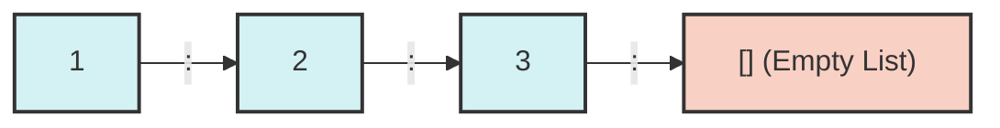

import { Quiz } from '@/components/quiz';
import { quizData } from '@/content/quiz-data/sem3/csi243/03-lists-quiz';

# Lists & Pattern Matching

Lists are the most fundamental and ubiquitous data structure in Haskell. Understanding how they are constructed and deconstructed is crucial for mastering functional programming. In this chapter, we explore the anatomy of lists, the elegance of pattern matching, and the expressive power of list comprehensions.

## The Anatomy of a List

In Haskell, a list is a singly-linked structure. It is built from two fundamental components:
1. The **empty list**, denoted by `[]`.
2. The **Cons operator** (`:`), which prepends an element to an existing list.

> **Analogy**: Think of a list like a train. The Cons operator (`:`) is the coupling that attaches a new train car (the element) to the front of an existing train (the rest of the list). The empty list `[]` is the caboose at the very end.

Because `:` is **right-associative**, the syntactic sugar `[1, 2, 3]` is exactly equivalent to:
```haskell
1 : (2 : (3 : []))
```



## Pattern Matching

Pattern matching allows us to deconstruct data by matching its "shape". Instead of using index-based access (like `list[0]`), we describe the structure we expect and bind variables to its parts.

```haskell
myHead :: [a] -> a
myHead (x:_) = x      -- Extract the head 'x', ignore the tail '_'
myHead [] = error "Empty list!"
```

### The Wildcard (`_`)
The underscore `_` is a **wildcard pattern**. It matches any value but does not bind it to a variable name. This is useful when you care about the structure but not the specific value, and it prevents compiler warnings about unused variables.

### As-Patterns (`@`)
Sometimes you need to deconstruct a value but also keep a reference to the original, intact structure. **As-patterns** allow you to do both simultaneously.

```haskell
-- 'all' binds to the entire list, while 'x' and 'xs' deconstruct it
checkFirst :: [Int] -> String
checkFirst all@(x:xs) 
  | x > 10    = "First element is large: " ++ show all
  | otherwise = "First element is small: " ++ show x
checkFirst [] = "Empty list"
```

## List Comprehensions

List comprehensions provide a concise, declarative way to generate and transform lists, directly inspired by mathematical **set-builder notation**.

The general syntax is:
`[ expression | generator, predicate, ... ]`

- **Generator**: `x <- [1..10]` (Draws values from a source list)
- **Predicate**: `even x` (Filters the drawn values)
- **Expression**: `x^2` (Transforms the filtered values)

```haskell
-- Generate squares of even numbers from 1 to 10
squaresOfEvens :: [Int]
squaresOfEvens = [x^2 | x <- [1..10], even x]
-- Result: [4, 16, 36, 64, 100]

-- Multiple generators (Cartesian product)
coordinates :: [(Int, Int)]
coordinates = [(x, y) | x <- [1, 2], y <- [3, 4]]
-- Result: [(1,3), (1,4), (2,3), (2,4)]
```

<Quiz title="Chapter 3 Knowledge Check" questions={quizData} />