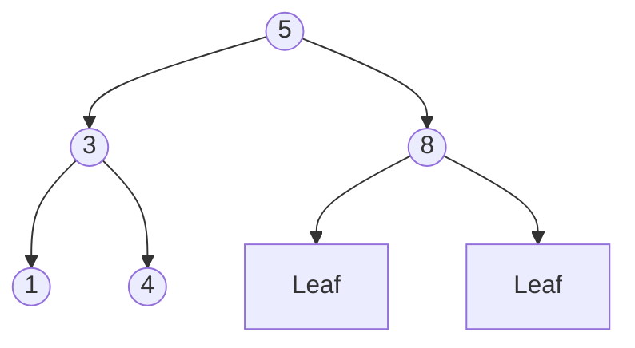

import { quizData } from '@/content/quiz-data/sem3/csi243/03-adts-modules-quiz';

# Chapter 3: Algebraic Data Types & The Module System

## Learning Objectives
1. Define basic Algebraic Data Types (ADTs) and write functions that pattern match on their constructors.
2. Structure Haskell programs using the Module System, including selective exports and qualified imports.
3. Implement recursive ADTs following a standard framework, such as a Binary Search Tree.
4. Calculate the cardinality of Sum, Product, and Exponential types to reason about program correctness.
5. Utilise `newtype` for zero-overhead domain modelling and enforce invariants via Smart Constructors.

---

## 3.1 Basic ADTs & Pattern Matching

Algebraic Data Types (ADTs) allow you to define custom data structures by combining types using **Sum** (OR) and **Product** (AND) logic. 

Consider a geometric shape. A shape can be a Circle **OR** a Rectangle (Sum). A Rectangle has a width **AND** a height (Product).

```haskell
data Shape = Circle Float | Rect Float Float
```

To use this data, we **pattern match** on its constructors. Pattern matching deconstructs the data, binding the internal values to variables so we can compute with them.

```haskell
area :: Shape -> Float
area (Circle r) = pi * r * r          -- Matches Circle, binds radius to 'r'
area (Rect w h) = w * h               -- Matches Rect, binds width to 'w', height to 'h'

-- GHCi session
ghci> area (Circle 5.0)
78.539816
ghci> area (Rect 3.0 4.0)
12.0
```

> ⚠️ **Common Misconception:** "Pattern matching is just like a `switch` statement in C/Java."
> **Correction:** Unlike a `switch`, Haskell pattern matching is **exhaustive**. If you forget a case (e.g., omit `Rect`), GHC will emit a compile-time warning (`-Wincomplete-patterns`), preventing runtime crashes.

---

## 3.2 The Module System (CRITICAL)

Haskell programs are organised into modules. A module controls **encapsulation**: what is visible to the outside world and what remains hidden.

### Defining and Exporting a Module

At the very top of a `.hs` file, you declare the module name and explicitly list what to export.

```haskell
-- File: Geometry.hs
module Geometry 
  ( Shape(..)   -- Exports the type 'Shape' AND all its constructors (Circle, Rect)
  , area        -- Exports the 'area' function
  ) where

data Shape = Circle Float | Rect Float Float

area :: Shape -> Float
area (Circle r) = pi * r * r
area (Rect w h) = w * h
```

**Selective Exporting:**
- `Shape` (without `..`) exports the type name, but **hides** the constructors. External code cannot pattern match or construct `Shape` values directly. This is the foundation of **Smart Constructors** (see Section 3.5).
- `Shape(..)` exports the type and all constructors.
- `Shape(Circle)` exports the type and only the `Circle` constructor.

### Importing Modules

When using other modules, you can control how their names enter your namespace to avoid clashes.

```haskell
-- File: Main.hs
module Main where

-- 1. Selective Import: Brings only 'nub' and 'sort' into scope
import Data.List (nub, sort)

-- 2. Qualified Import: Brings everything in, but requires a prefix.
-- Prevents name clashes (e.g., if you have your own 'map' function).
import qualified Data.Map as Map

main :: IO ()
main = do
    let nums = [3, 1, 2, 1]
    print (sort (nub nums))               -- Uses imported 'sort' and 'nub'
    
    -- Uses the qualified prefix 'Map.'
    let myMap = Map.fromList [("Alice", 25), ("Bob", 30)]
    print (Map.lookup "Alice" myMap)      -- Output: Just 25
```

--- a

## 3.3 Recursive ADTs: The 5-Part Framework

ADTs can refer to themselves, enabling recursive structures like linked lists and trees. When defining a recursive ADT, follow this standard 5-part framework:

1. **Type Definition**: Declare the type and its constructors.
2. **Base Case**: The terminating condition (e.g., an empty list or leaf).
3. **Recursive Case**: The constructor that contains the type itself.
4. **Core Operation**: A function that manipulates the structure (e.g., insertion).
5. **Traversal/Utility**: A function that extracts or transforms the data (e.g., to a list).

### Example: Binary Search Tree (BST)

```haskell
-- 1. Type Definition
data Tree a = 
    -- 2. Base Case
    Leaf 
    -- 3. Recursive Case
  | Node (Tree a) a (Tree a)
  deriving (Show, Eq)

-- 4. Core Operation: Insertion
insert :: Ord a => a -> Tree a -> Tree a
insert x Leaf = Node Leaf x Leaf
insert x (Node left val right)
    | x == val    = Node left val right       -- Already present
    | x <  val    = Node (insert x left) val right
    | otherwise   = Node left val (insert x right)

-- 5. Traversal: In-order traversal yields a sorted list
toList :: Tree a -> [a]
toList Leaf             = []
toList (Node left v right) = toList left ++ [v] ++ toList right

-- GHCi session
ghci> let t = foldr insert Leaf [5, 3, 8, 1, 4]
ghci> toList t
[1,3,4,5,8]
```


*Figure 3.1: BST after inserting [5,3,8,1,4]. In-order traversal yields [1,3,4,5,8].*

---

## 3.4 Advanced Theory: The Algebra of Types

Types are sets of values. We can count those values — the *cardinality* of a type — and this number has a direct consequence for how many possible states your program can be in.

- **Unit:** `data Unit = Unit` — exactly 1 state. Represents "no information".
- **Bool:** `data Bool = False | True` — exactly 2 states.
- **Product (AND):** `data Pair = P Bool Bool` — $2 \times 2 = 4$ states. Both fields exist simultaneously.
- **Sum (OR):** `data Choice = A Bool | B Bool` — $2 + 2 = 4$ states. Exactly one constructor is active.
- **Exponential (Functions):** `Bool -> Bool` — $2^2 = 4$ possible mappings.

```haskell
-- The four possible values of Bool -> Bool:
alwaysTrue  :: Bool -> Bool
alwaysTrue  _ = True

alwaysFalse :: Bool -> Bool
alwaysFalse _ = False

identity    :: Bool -> Bool
identity    x = x

negate'     :: Bool -> Bool
negate'     True  = False
negate'     False = True
```

Function cardinality $|b|^{|a|}$ means: for each possible input, you independently choose one of $|b|$ outputs.

---

## 3.5 Advanced Theory: `newtype` vs `data` & Smart Constructors

Haskell provides three ways to introduce a named type:

```haskell
-- (1) type alias — no new type, just a synonym
type Name = String

-- (2) data — allocates a constructor tag at runtime
data Age = Age Int

-- (3) newtype — exactly ONE constructor, ONE field; erased at compile time
newtype Age' = Age' Int
```

The critical difference between `data Age = Age Int` and `newtype Age' = Age' Int` is **runtime representation**:
- A `data` constructor carries a **tag byte** (or word) at runtime so the GC and pattern-matcher can identify which constructor is present. Even `data Wrapper = Wrap Int` allocates a small header.
- A `newtype` constructor is **erased entirely at compile time**. At runtime, `Age' 42` is indistinguishable from the bare `Int` value `42`. There is zero overhead.

### Smart Constructors via Module Encapsulation

We combine `newtype` with the Module System to enforce domain invariants.

```haskell
-- File: Age.hs
module Age 
  ( Age        -- Export the type, but NOT the constructor!
  , mkAge      -- Export the smart constructor
  , getAge     -- Export the accessor
  ) where

newtype Age = Age Int   -- Constructor is HIDDEN from external modules

mkAge :: Int -> Either String Age
mkAge i
    | i >= 0    = Right (Age i)
    | otherwise = Left "Age cannot be negative"

getAge :: Age -> Int
getAge (Age i) = i
```

External code cannot write `Age (-5)` — the constructor is not exported. They *must* use `mkAge`, which enforces the invariant. Because `newtype` is erased, they pay no runtime penalty for this safety.

---

## 3.6 Compiler Error Examples

❌ **WRONG CODE (Constructing a Smart-Constructor type directly)**

```haskell
-- (pretend Age constructor is not exported)
makeUser :: Int -> String -> String
makeUser rawAge name = name ++ " age: " ++ show (getAge (Age rawAge))
```
**GHC Error:**
```text
Not in scope: data constructor 'Age'
```

✅ **CORRECTED CODE**

```haskell
makeUser :: Int -> String -> IO String
makeUser rawAge name = case mkAge rawAge of
    Left err  -> fail err
    Right age -> return (name ++ " age: " ++ show (getAge age))
```

❌ **WRONG CODE (Deriving `Ord` on a type without `Eq`)**

```haskell
data Priority = Low | Medium | High deriving (Ord)
```
**GHC Error:**
```text
No instance for (Eq Priority)
  arising from the superclass constraint of 'Ord'
Derive 'Eq' first.
```

✅ **CORRECTED CODE**

```haskell
data Priority = Low | Medium | High deriving (Eq, Ord, Show)
```
`Ord` has `Eq` as a superclass — you cannot be ordered without being comparable for equality.

<Quiz title="Chapter 3 Knowledge Check" questions={quizData} />