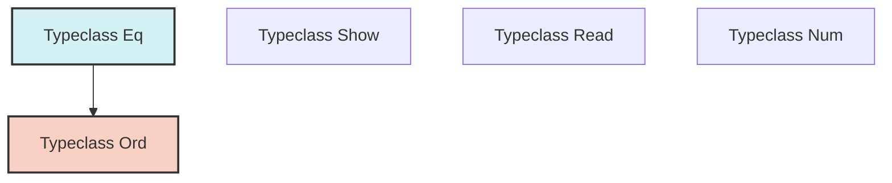

import { Quiz } from '@/components/quiz';
import { quizData } from '@/content/quiz-data/sem3/csi243/05-types-quiz';

# The Type System

Haskell's type system is one of its most powerful features. It is **strong** (no implicit coercions), **static** (checked at compile time), and features **type inference**, meaning you rarely need to write explicit type annotations, though doing so is considered best practice for documentation.

## Type Inference vs. Type Checking
- **Type Inference (Hindley-Milner)**: The compiler deduces the most general type for an expression without explicit annotations. For example, given `id x = x`, the compiler infers `id :: a -> a`.
- **Type Checking (Unification)**: The compiler verifies that two types can be made identical by substituting type variables. If unification fails, you get a compile-time error, preventing entire classes of runtime bugs.

## Polymorphism
Haskell supports two primary forms of polymorphism:
1. **Parametric Polymorphism**: The function behaves uniformly for *any* type. 
   - Example: `length :: [a] -> Int`. The function doesn't care what `a` is. This yields "Free Theorems" (e.g., a function of type `a -> a` can only be the identity function).
2. **Ad-Hoc Polymorphism (Typeclasses)**: The function behaves differently based on type constraints.
   - Example: `(+) :: Num a => a -> a -> a`. The `+` operator works differently for `Int` and `Float`, but the type signature guarantees both operands are of the same numeric type.

## Core Typeclasses
Typeclasses define a set of functions that a type must implement to be considered an instance of that class.
- **`Eq`**: Supports equality testing (`==`, `/=`).
- **`Ord`**: Supports ordering (`<`, `>`, `<=`, `>=`, `compare`). Requires `Eq`.
- **`Show`**: Can be converted to a `String` (for printing).
- **`Read`**: Can be parsed from a `String`.
- **`Num`**: Numeric operations (`+`, `-`, `*`).

<Quiz title="Chapter 5 Knowledge Check" questions={quizData} />