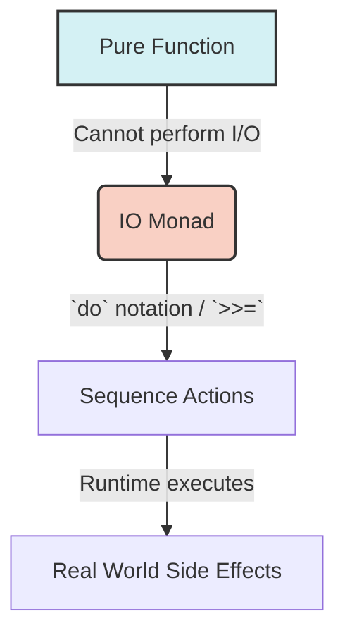

import { Quiz } from '@/components/quiz';
import { quizData } from '@/content/quiz-data/sem3/csi243/07-abstractions-quiz';

# Abstraction of Control

Haskell abstracts control flow not through statements, but through **Typeclasses**. This allows us to write generic code that works across different "contexts" (like lists, maybe values, or IO actions).

## 1. Functors (Mapping)
A **Functor** represents a context or container that you can map over. If you have a function `a -> b` and a context `f a`, `fmap` applies the function inside the context, yielding `f b`.

```haskell
class Functor f where
    fmap :: (a -> b) -> f a -> f b

-- Examples:
fmap (*2) [1, 2, 3]       -- Result: [2, 4, 6]
fmap (*2) (Just 5)        -- Result: Just 10
fmap (*2) Nothing         -- Result: Nothing
```
> **Analogy**: A Functor is like a sealed box. You can't take the value out, but you can slip a function inside the box to transform the value, and the box remains sealed.

## 2. Monads (Sequencing)
Functors cannot sequence dependent operations (where the second operation depends on the result of the first). **Monads** solve this via the bind operator (`>>=`).

```haskell
class Monad m where
    (>>=) :: m a -> (a -> m b) -> m b
    return :: a -> m a
```
If the first computation yields a value, it is passed to the next function. If it yields a "failure" context (like `Nothing`), the chain short-circuits.

## 3. The IO Monad (Building Applications)
Haskell strictly separates pure mathematical functions from impure real-world interactions. The `IO a` type represents a **recipe** or **program** that, when executed by the runtime, will perform side effects and yield a value of type `a`.

```haskell
main :: IO ()
main = do
    putStrLn "Enter your name:"
    name <- getLine          -- Extracts the String from the IO context
    putStrLn ("Hello, " ++ name ++ "!")
```
The `do` notation is syntactic sugar that desugars into chained `>>=` operations, making monadic code read like imperative code while preserving purity at the type level.



<Quiz title="Chapter 7 Knowledge Check" questions={quizData} />