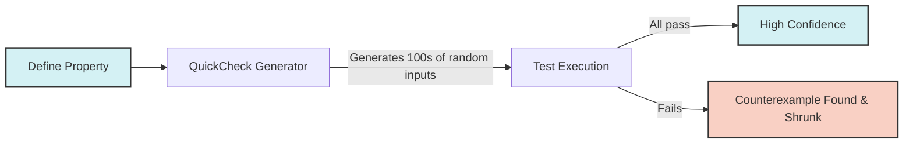

import { Quiz } from '@/components/quiz';
import { quizData } from '@/content/quiz-data/sem3/csi243/09-complexity-quiz';

# Property-Based Testing (QuickCheck)

Traditional unit testing checks specific, hardcoded examples. While useful, it is easy to miss edge cases. **Property-based testing** flips this paradigm: you define a mathematical invariant (a property that should *always* be true), and the framework automatically generates hundreds of random edge cases to try and break it.

## The QuickCheck Workflow
1. **Define a Property**: A function that takes inputs and returns a `Bool`.
2. **Run QuickCheck**: The library generates random inputs, tests the property, and reports the results.
3. **Shrinking**: If a test fails, QuickCheck automatically "shrinks" the failing input to the smallest possible counterexample, making debugging trivial.

```haskell
import Test.QuickCheck

-- Property: Reversing a list twice yields the original list
prop_reverse :: [Int] -> Bool
prop_reverse xs = reverse (reverse xs) == xs

-- Property: The length of a concatenated list is the sum of lengths
prop_length_append :: [Int] -> [Int] -> Bool
prop_length_append xs ys = length (xs ++ ys) == length xs + length ys

-- Run in GHCi: 
-- ghci> quickCheck prop_reverse
-- +++ OK, passed 100 tests.
```

## Custom Generators
If you are testing a custom ADT (like a `Tree`), you can define a custom `Arbitrary` instance to tell QuickCheck how to generate random valid instances of your type.



<Quiz title="Chapter 9 Testing Check" questions={quizData} />